# 🧠 Semantic Kernel COBOL Migration Process Function

## How It Works - Complete Architecture & Flow

The Semantic Kernel process function is an AI-powered COBOL-to-Java migration system that uses Microsoft Semantic Kernel framework to orchestrate multiple specialized AI agents. Here's how it works:

## 🏗️ System Architecture

```mermaid
graph TB
    %% User Interaction Layer
    CLI[👤 Command Line Interface<br/>Program.cs]
    
    %% Configuration Layer
    CONFIG[⚙️ Configuration Layer<br/>appsettings.json<br/>Environment Variables]
    
    %% Core Process Orchestrator
    PROCESS[🎯 Migration Process<br/>MigrationProcess.cs<br/>Main Orchestrator]
    
    %% AI Agents Layer
    subgraph AGENTS ["🤖 AI Agents (Semantic Kernel)"]
        COBOL_AGENT[🔍 CobolAnalyzerAgent<br/>Analyzes COBOL Structure]
        JAVA_AGENT[☕ JavaConverterAgent<br/>Converts to Java Quarkus]
        DEP_AGENT[🗺️ DependencyMapperAgent<br/>Maps Dependencies]
    end
    
    %% AI Service Layer
    subgraph AI_SERVICES ["🧠 AI Services"]
        AZURE_OPENAI[🌐 Azure OpenAI<br/>GPT-4.1 Models]
        OPENAI[🤖 OpenAI API<br/>Alternative Provider]
    end
    
    %% Helper Services
    subgraph HELPERS ["🛠️ Helper Services"]
        FILE_HELPER[📁 FileHelper<br/>File Operations]
        LOGGER[📊 EnhancedLogger<br/>API Call Tracking]
        CHAT_LOGGER[💬 ChatLogger<br/>Conversation Logging]
    end
    
    %% Data Models
    subgraph MODELS ["📋 Data Models"]
        COBOL_MODEL[📄 CobolFile<br/>Source Data]
        ANALYSIS_MODEL[🔬 CobolAnalysis<br/>Analysis Results]
        JAVA_MODEL[☕ JavaFile<br/>Generated Code]
        DEP_MODEL[🗺️ DependencyMap<br/>Relationships]
    end
    
    %% Input/Output
    INPUT[📂 Input<br/>COBOL Files .cbl, .cpy]
    OUTPUT[📤 Output<br/>Java Files + Reports]
    
    %% Connections
    CLI --> CONFIG
    CLI --> PROCESS
    CONFIG --> PROCESS
    PROCESS --> AGENTS
    AGENTS --> AI_SERVICES
    PROCESS --> HELPERS
    AGENTS --> HELPERS
    HELPERS --> MODELS
    AGENTS --> MODELS
    INPUT --> PROCESS
    PROCESS --> OUTPUT
    
    %% Styling
    classDef userLayer fill:#e1f5fe,stroke:#0277bd,stroke-width:2px,color:#000000
    classDef processLayer fill:#f3e5f5,stroke:#7b1fa2,stroke-width:2px,color:#000000
    classDef agentLayer fill:#e8f5e8,stroke:#388e3c,stroke-width:2px,color:#000000
    classDef serviceLayer fill:#fff3e0,stroke:#f57c00,stroke-width:2px,color:#000000
    classDef helperLayer fill:#fce4ec,stroke:#c2185b,stroke-width:2px,color:#000000
    classDef modelLayer fill:#f1f8e9,stroke:#689f38,stroke-width:2px,color:#000000
    classDef ioLayer fill:#e0f2f1,stroke:#00796b,stroke-width:2px,color:#000000
    
    class CLI,CONFIG userLayer
    class PROCESS processLayer
    class COBOL_AGENT,JAVA_AGENT,DEP_AGENT agentLayer
    class AZURE_OPENAI,OPENAI serviceLayer
    class FILE_HELPER,LOGGER,CHAT_LOGGER helperLayer
    class COBOL_MODEL,ANALYSIS_MODEL,JAVA_MODEL,DEP_MODEL modelLayer
    class INPUT,OUTPUT ioLayer
```



## 🔄 Migration Process Flow (6 Main Steps)

```mermaid
sequenceDiagram
    participant User as 👤 User
    participant CLI as 🖥️ CLI Program
    participant Process as 🎯 MigrationProcess
    participant Agents as 🤖 AI Agents
    participant AI as 🧠 Azure OpenAI
    participant Files as 📁 FileHelper
    participant Logs as 📊 Loggers
    
    User->>CLI: ./run.sh or dotnet run
    CLI->>CLI: Parse command line args
    CLI->>Process: Initialize with settings
    
    Note over Process: Step 1: File Discovery
    Process->>Files: Scan COBOL directory
    Files-->>Process: List of .cbl and .cpy files
    Process->>Logs: Log file discovery stats
    
    Note over Process: Step 2: Dependency Analysis
    Process->>Agents: DependencyMapperAgent.AnalyzeDependenciesAsync()
    Agents->>AI: Analyze COBOL relationships
    AI-->>Agents: Dependency insights
    Agents-->>Process: DependencyMap with Mermaid diagram
    Process->>Files: Save dependency-map.json
    
    Note over Process: Step 3: COBOL Analysis
    loop For each COBOL file
        Process->>Agents: CobolAnalyzerAgent.AnalyzeCobolFileAsync()
        Agents->>AI: Analyze COBOL structure
        AI-->>Agents: Structured analysis
        Agents-->>Process: CobolAnalysis object
        Process->>Logs: Log analysis progress
    end
    
    Note over Process: Step 4: Java Conversion
    loop For each analyzed file
        Process->>Agents: JavaConverterAgent.ConvertToJavaAsync()
        Agents->>AI: Convert COBOL to Java Quarkus
        AI-->>Agents: Java code
        Agents-->>Process: JavaFile object
        Process->>Logs: Log conversion progress
    end
    
    Note over Process: Step 5: File Generation
    loop For each Java file
        Process->>Files: Save Java file to output directory
        Files-->>Process: Confirmation
        Process->>Logs: Log file save progress
    end
    
    Note over Process: Step 6: Report Generation
    Process->>Files: Generate migration-report.md
    Process->>Logs: Export conversation logs
    Process->>Logs: Show API statistics
    Process-->>CLI: Migration complete
    CLI-->>User: Success message + metrics
```



## 🧠 How Semantic Kernel Orchestrates AI Agents

```mermaid
graph TB
    subgraph SK_KERNEL ["🧠 Semantic Kernel Framework"]
        direction TB
        KERNEL["🔧 Kernel Builder<br/>• Chat Completion Services<br/>• Service Configuration<br/>• API Connection Management"]
        PROMPT_ENGINE["📝 Prompt Engineering<br/>• System Prompts<br/>• User Prompts<br/>• Context Management"]
        EXECUTION["⚙️ Execution Settings<br/>• Token Limits (32K)<br/>• Temperature (0.1)<br/>• Model Selection"]
    end
    
    subgraph AGENT_LIFECYCLE ["🔄 Agent Lifecycle Process"]
        direction TB
        INIT["1️⃣ Initialize Agent<br/>• Load Model Configuration<br/>• Set Specialized Prompts<br/>• Configure Logging"]
        PROMPT["2️⃣ Create Task Prompt<br/>• Build System Context<br/>• Add COBOL Content<br/>• Define Output Format"]
        EXECUTE["3️⃣ Execute via Kernel<br/>• Send to AI Service<br/>• Monitor API Call<br/>• Handle Timeouts"]
        PROCESS_RESPONSE["4️⃣ Process Response<br/>• Parse AI Output<br/>• Validate Results<br/>• Extract Structured Data"]
        LOG["5️⃣ Log & Track<br/>• Record API Metrics<br/>• Track Performance<br/>• Store Conversation"]
        
        INIT --> PROMPT
        PROMPT --> EXECUTE
        EXECUTE --> PROCESS_RESPONSE
        PROCESS_RESPONSE --> LOG
    end
    
    subgraph AI_MODELS ["🤖 AI Model Specialization"]
        direction TB
        ANALYZER_MODEL["🔍 COBOL Analyzer<br/>• Structure Analysis<br/>• Variable Mapping<br/>• Logic Flow Analysis<br/>• Copybook Detection"]
        CONVERTER_MODEL["☕ Java Converter<br/>• Code Translation<br/>• Quarkus Integration<br/>• Best Practices<br/>• Error Handling"]
        DEPENDENCY_MODEL["🗺️ Dependency Mapper<br/>• Relationship Analysis<br/>• Mermaid Diagrams<br/>• Usage Patterns<br/>• Metrics Calculation"]
    end
    
    %% Connections
    SK_KERNEL --> AGENT_LIFECYCLE
    AGENT_LIFECYCLE --> AI_MODELS
    
    %% Enhanced Styling
    classDef kernelStyle fill:#e3f2fd,stroke:#1976d2,stroke-width:3px,color:#000000
    classDef lifecycleStyle fill:#f1f8e9,stroke:#689f38,stroke-width:3px,color:#000000
    classDef modelStyle fill:#fff3e0,stroke:#f57c00,stroke-width:3px,color:#000000
    classDef stepStyle fill:#f3e5f5,stroke:#7b1fa2,stroke-width:2px,color:#000000
    
    class KERNEL,PROMPT_ENGINE,EXECUTION kernelStyle
    class INIT,PROMPT,EXECUTE,PROCESS_RESPONSE,LOG stepStyle
    class ANALYZER_MODEL,CONVERTER_MODEL,DEPENDENCY_MODEL modelStyle
```



## 🎯 Core Components Explained

### 1. **Program.cs - Entry Point**
- **Purpose**: Command-line interface and configuration setup
- **Key Functions**:
  - Parses command-line arguments (`--cobol-source`, `--java-output`, `--config`)
  - Loads application settings from JSON configuration
  - Initializes Semantic Kernel with Azure OpenAI or OpenAI
  - Sets up HTTP client with extended timeouts for large files
  - Creates and configures the main MigrationProcess

### 2. **MigrationProcess.cs - Orchestrator**
- **Purpose**: Main workflow orchestrator that coordinates all migration steps
- **Key Responsibilities**:
  - **Agent Initialization**: Creates and configures all AI agents
  - **File Discovery**: Scans directories for COBOL files (.cbl) and copybooks (.cpy)
  - **Dependency Analysis**: Maps relationships between COBOL programs
  - **COBOL Analysis**: Analyzes each file's structure and logic
  - **Java Conversion**: Converts COBOL to Java Quarkus code
  - **File Generation**: Saves all generated Java files
  - **Report Creation**: Generates comprehensive migration reports

### 3. **AI Agents - Specialized Experts**

#### **CobolAnalyzerAgent**
- **Purpose**: Expert in COBOL code analysis
- **AI Prompt**: Specialized system prompt for understanding COBOL structure
- **Output**: Structured analysis including:
  - Data divisions and variables
  - Procedure divisions and paragraphs
  - Logic flow and control structures
  - Copybook references

#### **JavaConverterAgent**
- **Purpose**: Expert in COBOL-to-Java conversion
- **AI Prompt**: Specialized for Java Quarkus code generation
- **Output**: Complete Java classes with:
  - Proper class structures
  - Modern Java data types
  - Quarkus framework integration
  - Error handling and best practices

#### **DependencyMapperAgent**
- **Purpose**: Expert in dependency analysis and visualization
- **Capabilities**:
  - Analyzes COBOL program relationships
  - Identifies copybook usage patterns
  - Generates Mermaid dependency diagrams
  - Calculates dependency metrics

### 4. **Helper Services**

#### **FileHelper**
- **Purpose**: Handles all file operations
- **Functions**:
  - Scanning directories for COBOL files
  - Reading and writing files
  - Creating output directory structures
  - Saving JSON and Markdown reports

#### **EnhancedLogger**
- **Purpose**: Advanced logging with API call tracking
- **Features**:
  - Behind-the-scenes activity logging
  - API call performance metrics
  - Progress bars and status updates
  - Cost analysis and token tracking

#### **ChatLogger**
- **Purpose**: Records AI conversations
- **Output**:
  - Complete chat logs in Markdown format
  - JSON conversation exports
  - Statistics on messages and tokens

## 🔧 Configuration & Settings

### **appsettings.json Structure**
```json
{
  "AISettings": {
    "ServiceType": "AzureOpenAI",
    "Endpoint": "https://your-resource.openai.azure.com/",
    "ApiKey": "your-api-key",
    "DeploymentName": "gpt-4.1",
    "ModelId": "gpt-4.1",
    "CobolAnalyzerModelId": "gpt-4.1",
    "JavaConverterModelId": "gpt-4.1",
    "DependencyMapperModelId": "gpt-4.1"
  },
  "ApplicationSettings": {
    "CobolSourceFolder": "SampleCobol",
    "JavaOutputFolder": "JavaOutput"
  }
}
```

## 📊 Performance & Metrics

### **Real Migration Statistics**
- **📁 Source Files**: 102 COBOL files processed
- **☕ Generated Files**: 99 Java files created
- **🔗 Dependencies**: Complex relationship mapping
- **⏱️ Processing Time**: ~1.2 hours for full migration
- **💰 AI Cost**: $0.31 for complete migration
- **📞 API Calls**: 205 calls to Azure OpenAI
- **🎯 Success Rate**: 97% successful conversion

### **Output Artifacts**
1. **Java Packages**: Organized by functionality
   - `com.example.*` - Business logic (85 files)
   - `org.example.*` - Batch processors (5 files)
   - `com.company.*` - Domain-specific logic (2 files)
   - `com.enterprise.*` - Enterprise services (2 files)
   - `model.*` - Data models (2 files)

2. **Documentation**:
   - `dependency-map.json` - Complete dependency analysis
   - `dependency-diagram.md` - Mermaid visualization
   - `migration-report.md` - Comprehensive migration summary
   - `migration-conversation-log.md` - AI agent conversations

3. **Logs Directory**:
   - API call tracking logs
   - Processing step logs
   - Error and warning logs
   - Performance metrics

## 🎯 Key Benefits of Semantic Kernel Architecture

1. **🧠 AI Orchestration**: Seamlessly manages multiple AI models and prompts
2. **🔄 Workflow Management**: Handles complex multi-step processes
3. **📊 Observability**: Complete tracking of AI interactions and performance
4. **🎚️ Configurability**: Easy switching between AI providers and models
5. **🧪 Extensibility**: Simple to add new agents and capabilities
6. **🛡️ Error Handling**: Robust error handling and recovery mechanisms
7. **📈 Scalability**: Efficient processing of large COBOL codebases

This Semantic Kernel-based architecture transforms the complex task of COBOL-to-Java migration into a manageable, observable, and highly effective automated process! 🚀

## 📍 Where Semantic Kernel Process Functions Are Used

### 🎯 **1. Main Entry Point - Program.cs**

```csharp
// Initialize kernel builder
var kernelBuilder = Kernel.CreateBuilder();

if (settings.AISettings.ServiceType.Equals("OpenAI", StringComparison.OrdinalIgnoreCase))
{
    kernelBuilder.AddOpenAIChatCompletion(
        modelId: settings.AISettings.ModelId,
        apiKey: settings.AISettings.ApiKey);
}
else if (settings.AISettings.ServiceType.Equals("AzureOpenAI", StringComparison.OrdinalIgnoreCase))
{
    kernelBuilder.AddAzureOpenAIChatCompletion(
        deploymentName: settings.AISettings.DeploymentName,
        endpoint: settings.AISettings.Endpoint,
        apiKey: settings.AISettings.ApiKey,
        httpClient: httpClient);
}

// Pass kernel builder to migration process
var migrationProcess = new MigrationProcess(kernelBuilder, logger, fileHelper, settings);
```

**What this does:**
- **Creates the Semantic Kernel foundation** that all agents will use
- **Configures AI service connection** (Azure OpenAI or OpenAI)
- **Sets up HTTP client** with extended timeouts for large COBOL files
- **Passes kernel builder** to the migration orchestrator

---

### 🏗️ **2. Agent Initialization - MigrationProcess.cs**

```csharp
public void InitializeAgents()
{
    // Each agent gets the kernel builder to create their own kernel instances
    _cobolAnalyzerAgent = new CobolAnalyzerAgent(
        _kernelBuilder,  // ← Semantic Kernel builder passed here
        logger,
        _settings.AISettings.CobolAnalyzerModelId,
        _enhancedLogger,
        _chatLogger);
    
    _javaConverterAgent = new JavaConverterAgent(
        _kernelBuilder,  // ← Semantic Kernel builder passed here
        logger,
        _settings.AISettings.JavaConverterModelId,
        _enhancedLogger,
        _chatLogger);
    
    _dependencyMapperAgent = new DependencyMapperAgent(
        _kernelBuilder,  // ← Semantic Kernel builder passed here
        logger,
        _settings.AISettings.DependencyMapperModelId,
        _enhancedLogger,
        _chatLogger);
}
```

**What this does:**
- **Distributes the kernel builder** to each specialized AI agent
- **Enables each agent** to create their own kernel instances
- **Maintains consistency** in AI service configuration across agents

---

### 🔍 **3. COBOL Analysis - CobolAnalyzerAgent.cs**

```csharp
public async Task<CobolAnalysis> AnalyzeCobolFileAsync(CobolFile cobolFile)
{
    // Build kernel instance from the builder
    var kernel = _kernelBuilder.Build();  // ← Creates Semantic Kernel instance
    
    // Create specialized prompts for COBOL analysis
    var systemPrompt = "You are an expert COBOL analyzer...";
    var prompt = $"Analyze the following COBOL program:\n\n{cobolFile.Content}";
    var fullPrompt = $"{systemPrompt}\n\n{prompt}";
    
    // Configure execution settings
    var executionSettings = new OpenAIPromptExecutionSettings
    {
        MaxTokens = 32768,
        Temperature = 0.1,
        TopP = 0.5
    };
    
    var kernelArguments = new KernelArguments(executionSettings);
    
    // Execute AI call through Semantic Kernel
    var functionResult = await kernel.InvokePromptAsync(  // ← SK process function call
        fullPrompt,
        kernelArguments);
    
    var analysisText = functionResult.GetValue<string>();
    // Parse response into structured CobolAnalysis object
}
```

**What this does:**
- **Creates kernel instance** from the shared builder
- **Uses specialized COBOL analysis prompts** 
- **Configures AI parameters** (tokens, temperature)
- **Executes AI call** through `kernel.InvokePromptAsync()` - **this is the core SK process function**
- **Returns structured analysis** of COBOL code

---

### ☕ **4. Java Conversion - JavaConverterAgent.cs**

```csharp
public async Task<JavaFile> ConvertToJavaAsync(CobolFile cobolFile, CobolAnalysis analysis)
{
    // Build kernel instance
    var kernel = _kernelBuilder.Build();  // ← Creates SK instance
    
    // Create Java conversion prompts
    var systemPrompt = "You are an expert in converting COBOL to Java Quarkus...";
    var prompt = $"Convert the following COBOL program to Java:\n\n{cobolFile.Content}";
    
    // Execute conversion through Semantic Kernel
    var functionResult = await kernel.InvokePromptAsync(  // ← SK process function call
        fullPrompt,
        kernelArguments);
    
    var javaCode = functionResult.GetValue<string>();
    // Parse and structure Java output
}
```

**What this does:**
- **Uses same kernel builder** but with Java conversion expertise
- **Applies specialized Java/Quarkus prompts**
- **Executes conversion** through `kernel.InvokePromptAsync()` - **core SK process function**
- **Returns structured Java file** with proper class definitions

---

### 🗺️ **5. Dependency Mapping - DependencyMapperAgent.cs**

```csharp
public async Task<DependencyMap> AnalyzeDependenciesAsync(List<CobolFile> files, List<CobolAnalysis> analyses)
{
    // Build kernel for dependency analysis
    var kernel = _kernelBuilder.Build();  // ← Creates SK instance
    
    // Create dependency analysis prompts
    var systemPrompt = "You are an expert in analyzing COBOL dependencies...";
    
    // Execute dependency analysis through Semantic Kernel
    var functionResult = await kernel.InvokePromptAsync(  // ← SK process function call
        fullPrompt,
        kernelArguments);
    
    // Parse dependency relationships and generate Mermaid diagrams
}

private async Task<string> GenerateMermaidDiagramAsync(DependencyMap dependencyMap)
{
    // Build kernel for diagram generation
    var kernel = _kernelBuilder.Build();  // ← Creates SK instance
    
    // Execute Mermaid generation through Semantic Kernel
    var functionResult = await kernel.InvokePromptAsync(  // ← SK process function call
        diagramPrompt,
        kernelArguments);
    
    return functionResult.GetValue<string>();
}
```

**What this does:**
- **Analyzes program relationships** using AI through SK
- **Generates Mermaid diagrams** using AI through SK
- **Maps copybook usage** and dependencies
- **Calculates metrics** on dependency complexity

---

## 🔧 **Key Semantic Kernel Process Functions Used**

### **Primary SK Function:**
```csharp
kernel.InvokePromptAsync(prompt, kernelArguments)
```
- **Used in**: All 3 AI agents for every AI call
- **Purpose**: Execute AI prompts through configured AI service
- **Parameters**: 
  - `prompt` - The system + user prompt
  - `kernelArguments` - Execution settings (tokens, temperature, etc.)

### **Kernel Creation:**
```csharp
var kernel = _kernelBuilder.Build()
```
- **Used in**: Each agent method that needs AI
- **Purpose**: Create kernel instance from shared configuration
- **Result**: Ready-to-use kernel with AI service connection

### **Configuration Functions:**
```csharp
kernelBuilder.AddAzureOpenAIChatCompletion(...)
kernelBuilder.AddOpenAIChatCompletion(...)
```
- **Used in**: Program.cs initialization
- **Purpose**: Configure AI service connection
- **Result**: Kernel builder ready for agent distribution

---

## 🎯 **Process Function Flow**


**Summary:** The Semantic Kernel process functions are the **core engine** that powers every AI interaction in the migration tool, providing a consistent, observable, and manageable way to orchestrate complex AI workflows across multiple specialized agents! 🚀
